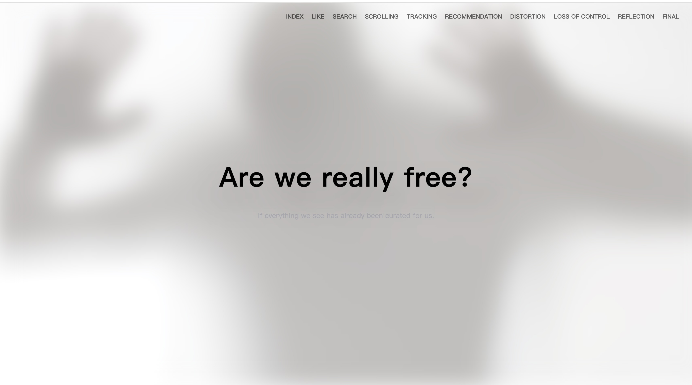
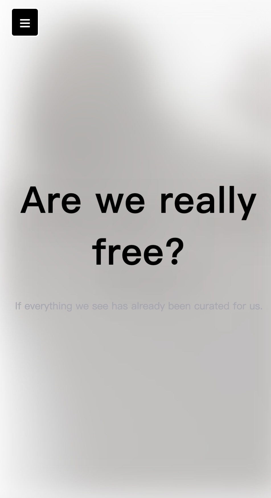

# FILTERED SELF : A SYSTEM OF CONTROL

This is a can display interaction, data choose and visual website works.Consumer can click heart trigger pictures and counter. There are also little surprises for players to discover.

## Quick Start
1. Open this folder in **VS Code**.
2. Install extensions: *Live Server*, *Prettier*, *HTML CSS Support*, *ESLint*.
3. Right-click `index.html` → **Open with Live Server** to preview.

## Notes
- This project was inspired by the p5.js sketch: https://editor.p5js.org/kelseybrod/sketches/o9gRxZBzG.
- The project is implemented using HTML, CSS, and JavaScript.
- This project uses images and videos found on Canva.

## Page-by-Page Description
## Introduction to the website
- My ten pages will explore people’s website behavior—how liking, searching, and scrolling are transformed into profitable data. Received from Shoshana Zuboff’s idea of behavioral surplus, this website will be made visual by giving them our “algorithmic freedom,” which is, in fact, an illusion shaped by algorithms.Using HTML, CSS, and p5.js to make a unit for dynamic effects, data-driven vision effects, and interactive design, this website makes Zuboff’s theory change to visual and emotional.

- 1. Home
-Display the question: “Are we really free?”
Lead users into a seemingly safe and familiar the internet environment.
- 2. Liking
- Show the surface interaction of social media likes, shares, and comments.
Making users conscious that these seemingly harmless behaviors are the data collection starting point.
- 3. Searching
- Simulate users typing keywords.
The background has random numbers or code, hinting that the sought data is preserved by the system.
- 4. Scrolling
- Display how the algorithm controls the feed.
Page auto-scrolling, to symbolize “passive browsing”
- 5. Tracking
- The visuals begin to darken, and data points or lines appear.
The page symbolizes user tracking and behavioral analysis.
- 6. Recommendation
- The page shows by automatic “you might be interested in”
Show how algorithms take over users' freedom of choice.
- 7. Distortion
- Images and text become blurred, twinkle, and change shape.
Express digital identity by algorithm definition or reshape
- 8. Loss of Control
- Users cannot control page interaction.
Meaning freedom was disappearing,and algorithms were allocating.
- 9. Reflection
- Vision was static; the text decreased.
Make users aware that the whole process is system controlled.
- 10. Final Question
- “Are we really expressing ourselves, or are we being shaped by the systems that watch us?”
Make users end the experience with reflection.

# FILTERED SELF: A SYSTEM OF CONTROL

